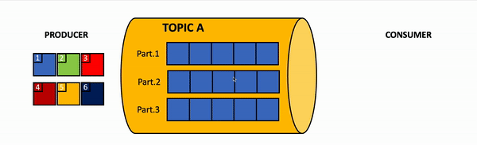

## Kafka Notes :

### Apache Kafka Download Links : 

 Download Page : https://kafka.apache.org/downloads

 Downloaded Version : https://downloads.apache.org/kafka/3.6.1/kafka_2.13-3.6.1.tgz

### 1. Start Zookeeper Server : 

	$ bin/zookeeper-server-start.sh config/zookeeper.properties

default port of zookeeper server : 2181

### 2. Start kafka server/broker :

	$ bin/kafka-server-start.sh config/server.properties
	
default port of kafka server : 9092
	
### 3. Create topic :

3.1 Create Topic : myfirst-topic

	$ bin/kafka-topics.sh --bootstrap-server localhost:9092 --create --topic myfirst-topic --partitions 3 --replication-factor 1

3.2 Create Topic : mysecond-topic

	$ bin/kafka-topics.sh --bootstrap-server localhost:9092 --create --topic mysecond-topic --partitions 3 --replication-factor 1

3.3 List all created topics :

	$ bin/kafka-topics.sh --bootstrap-server localhost:9092 --list

3.4 Describe topic :

	$ bin/kafka-topics.sh --bootstrap-server localhost:9092 --describe --topic myfirst-topic
	

### 4. Offset explorer Tool:
	Link to download :  https://www.kafkatool.com/download.html

	Required java 11 to install & run offset explorer.

### 5. Kafka Console Producer : 
	
	$ bin/kafka-console-producer.sh --bootstrap-server localhost:9092 --topic myfirst-topic
	
	>this is sample msg from producer

Note : To push bulk messages from csv file > $ bin/

	kafka-console-producer.sh --bootstrap-server localhost:9092 --topic myfirst-topic </home/arjunb/Downloads/customers-1000.csv

### 6.Kafka Console Consumer : 
	
	$ bin/kafka-console-consumer.sh --bootstrap-server localhost:9092 --topic myfirst-topic --from-beginning

	>this is sample msg from producer

### 7. Confluent Kafka [Community Edition] :

Link to Download : https://www.confluent.io/get-started/?product=self-managed	

7.1 Start Confluent Zookeeper Server :
		
	$ bin/zookeeper-server-start etc/kafka/zookeeper.properties 

7.2 Start Confluent Kafka Server :

	$ bin/kafka-server-start etc/kafka/server.properties 

7.3 Create topic :

	$ bin/kafka-topics --bootstrap-server localhost:9092 --create --topic mythird-topic

7.4 Produce Message :
	
	$ bin/kafka-console-producer --bootstrap-server localhost:9092 --topic mythird-topic
	>mobile:8796977808 
	>add: shivalaua hsg. soc., sus gaon, pune-411021

7.5 Consume Message :

	$ bin/kafka-console-consumer --bootstrap-server localhost:9092 --topic mythird-topic --from-beginning
	>mobile:8796977808
	>add: shivalaua hsg. soc., sus gaon, pune-411021

### Cosumer- Producer Working Diagram - 

------------------------------

### Kafka Without Zookeeper [ KRaft ] :

Open Terminal & Execute below commands : 

#### Generate a Cluster UUID :

	$ KAFKA_CLUSTER_ID="$(bin/kafka-storage.sh random-uuid)"

#### Format Log Directories :

	$ bin/kafka-storage.sh format -t $KAFKA_CLUSTER_ID -c config/kraft/server.properties

#### Start Kafka Server :

	$ bin/kafka-server-start.sh config/kraft/server.properties

#### Create Sample Topic :

	$ bin/kafka-topics.sh --bootstrap-server localhost:9092 --create --topic myfirst-topic --partitions 3 --replication-factor 1

#### Produce & Consume message on Topic :
 
 	$ bin/kafka-console-producer.sh --bootstrap-server localhost:9092 --topic myfirst-topic

	$ bin/kafka-console-consumer.sh --bootstrap-server localhost:9092 --topic myfirst-topic --from-beginning 

#### Showing metadata of cluster :

	$ bin/kafka-metadata-quorum.sh --bootstrap-server localhost:9092 describe --status

	ClusterId:              35TwHPFbQpKDSb8djNzTHw
	LeaderId:               1
	LeaderEpoch:            1
	HighWatermark:          2327
	MaxFollowerLag:         0
	MaxFollowerLagTimeMs:   0
	CurrentVoters:          [1]
	CurrentObservers:       []

#### Replication Info :

	$ bin/kafka-metadata-quorum.sh --bootstrap-server localhost:9092 describe --replication

	NodeId	LogEndOffset	Lag	LastFetchTimestamp	LastCaughtUpTimestamp	Status	
	1     	2498        	0  	1708767591655     	1708767591655        	Leader	
